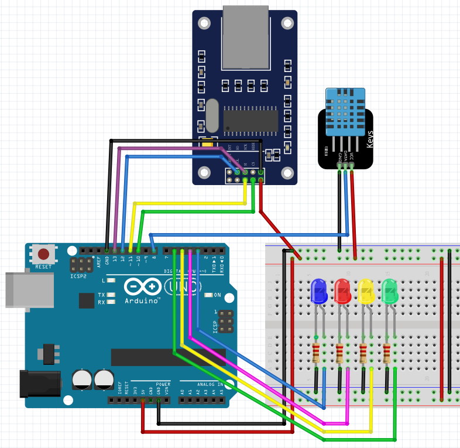

```js
// UIPEthernet.h  https://github.com/UIPEthernet/UIPEthernet
// PubSubClient.h  https://github.com/knolleary/pubsubclient
//增加RAM https://andrologiciels.wordpress.com/arduino/electronique/ram/

//#include <avr/pgmspace.h>

//#include <Wire.h>
//#include <LiquidCrystal_I2C.h>
//LiquidCrystal_I2C lcd(0x27, 20, 4);

#include <UIPEthernet.h>
#include <PubSubClient.h>
#define STATIC 0 // 設置為 1 以禁用 DHCP

// Update these with values suitable for your network.
uint8_t mac[6] = {0x00, 0xAA, 0xBB, 0xCC, 0xDE, 0x02};
IPAddress ip(192, 168, 0, 125);
//IPAddress dnss(192, 168, 0, 1);// the dns server ip
//IPAddress gateway(192, 168, 0, 1);// the router's gateway address:
//IPAddress subnet(255, 255, 255, 0);// the subnet:


//const char* mqtt_server = "MQTTGO.io";
const char* mqtt_server = "broker.emqx.io";
//const char* mqttUserName = "abcdefg";  // 使用者名稱，Username。
//const char* mqttPwd = "abcdefg";  //  使用者密碼，Password
const char* topicToSub = "inTopic88888"; //訂閱in
const char* topicToPub = "outTopic88888"; //發佈out


const PROGMEM char msg[22];


EthernetClient ethClient;
PubSubClient client(ethClient);

unsigned long  previous_millis_A = 0; //初始化以前的millis
unsigned long  interval_A = 10 * 1000; //間隔5秒執行


#include "DHT.h"
#define DHTPIN 8      //讀取DHT11 Data
#define DHTTYPE DHT11 //選用DHT11
DHT dht(DHTPIN, DHTTYPE); // Initialize DHT sensor
float h, t;

int led1 = 3;
int led2 = 4;
int led3 = 5;
int led4 = 6;


// Callback function
void callback(char* topic, byte* message, unsigned int length) {
  String receivedMsg;
  for (unsigned int i = 0; i < length; i++) {
    receivedMsg += (char)message[i];
  }
  //  Serial.print(F("訊息到達主題： "));
  //  Serial.print(topic);
  //  Serial.print(F(",Message: "));
  //  Serial.println(receivedMsg);
  if (String(topic) == topicToSub) {

    if (receivedMsg == ("led1on")) {
      //      Serial.println(F("led1on"));
      digitalWrite(led1, HIGH);
    } else if (receivedMsg == "led1off") {
      //      Serial.println(F("led1off"));
      digitalWrite(led1, LOW);
    }

    if (receivedMsg == ("led2on")) {
      //      Serial.println(F("led2on"));
      digitalWrite(led2, HIGH);
    } else if (receivedMsg == "led2off") {
      //      Serial.println(F("led2off"));
      digitalWrite(led2, LOW);
    }


    if (receivedMsg == ("led3on")) {
      //      Serial.println(F("led3on"));
      digitalWrite(led3, HIGH);
    } else if (receivedMsg == "led3off") {
      //      Serial.println(F("led3off"));
      digitalWrite(led3, LOW);
    }

    if (receivedMsg == ("led4on")) {
      //      Serial.println(F("led3on"));
      digitalWrite(led4, HIGH);
    } else if (receivedMsg == "led4off") {
      //      Serial.println(F("led3off"));
      digitalWrite(led4, LOW);
    }

    //-------------------------------------------------
  }
}


void reconnect() {
  // Loop until we're reconnected
  while (!client.connected()) {
    Serial.print(F("正在嘗試 MQTT 連接..."));
    // Create a random client ID
    String clientId = "UNO_Client-";
    clientId += String(random(0xffff), HEX);
    // Attempt to connect
    //    if (client.connect(clientId.c_str(), mqttUserName, mqttPwd)) {
    if (client.connect(clientId.c_str())) {
      Serial.println(F("連接"));
      // Once connected, publish an announcement...
      client.publish(topicToPub, "hello world");
      // ... and resubscribe
      client.subscribe(topicToSub);
    } else {
      Serial.print(F("failed, rc="));
      Serial.print(client.state());
      Serial.println(F(" 5 秒後重試"));
      // Wait 5 seconds before retrying
      delay(5000);
    }
  }
}

void setup()
{

  Serial.begin(9600);


#if STATIC
  Ethernet.begin(mac, ip);
  //    Ethernet.begin(mac, ip, dnss, gateway, subnet);
#else
  if (Ethernet.begin(mac) == 0) {
    //    Serial.println(F("Failed to configure Ethernet using DHCP"));
  }
#endif

  //  Serial.print(F("localIP: "));
  //  Serial.println(Ethernet.localIP());
  //  Serial.print(F("subnetMask: "));
  //  Serial.println(Ethernet.subnetMask());
  //  Serial.print(F("gatewayIP: "));
  //  Serial.println(Ethernet.gatewayIP());
  //  Serial.print(F("dnsServerIP: "));
  //  Serial.println(Ethernet.dnsServerIP());

  //---------mqtt------------
  client.setServer(mqtt_server, 1883);
  client.setCallback(callback);

  //------lcd--------
  //    lcd.init(); // initialize LCD
  //    lcd.backlight(); // 開啟背光
  //    lcd.setCursor(0, 0);
  //    lcd.print(F("IP:"));
  //    lcd.print(Ethernet.localIP());
  //  lcd.setCursor(0, 1);
  //  lcd.print(F("Mask:"));
  //  lcd.print(Ethernet.subnetMask());
  //  lcd.setCursor(0, 2);
  //  lcd.print(F("gw:"));
  //  lcd.print(Ethernet.gatewayIP());
  //  lcd.setCursor(0, 3);
  //  lcd.print(F("dns:"));
  //  lcd.print(Ethernet.dnsServerIP());


  //  delay(1500);

  //  lcd.setCursor(0, 1);
  //  lcd.print(F("                    "));
  //  lcd.setCursor(0, 3);
  //  lcd.print(F("                    "));
  //
  //  lcd.setCursor(0, 3);
  //  lcd.print(F("LED1:N"));
  //
  //  lcd.setCursor(7, 3);
  //  lcd.print(F("LED2:N"));
  //
  //  lcd.setCursor(14, 3);
  //  lcd.print(F("LED3:N"));


  pinMode(led1, OUTPUT);
  pinMode(led2, OUTPUT);
  pinMode(led3, OUTPUT);
  pinMode(led4, OUTPUT);


  dht.begin();//啟動DHT

}

void loop()
{

  h = dht.readHumidity();//讀取濕度
  t = dht.readTemperature();//讀取攝氏溫度
  //  float f = dht.readTemperature(true);//讀取華氏溫度

  if (!client.connected()) {
    reconnect();
  }

  client.loop();


  // 在此處添加您的發布代碼 --------------------
  // 選項 1 -- 基於計時器發布
  // 僅每 5 秒發布一次

  unsigned long int current_millis_A = millis();              //current_millis_A = 2000
  if ((current_millis_A - previous_millis_A) >= interval_A) { //(2000 - 1000) >= 1000
    previous_millis_A = current_millis_A;

    String msgStr =  "{\"T\":" +  String(t) + ",\"H\":" + String(h) + "}"; // 建立MQTT訊息（JSON格式的字串）
    msgStr.toCharArray(msg, 22); // 把String字串轉換成字元陣列格式 名稱長度不可超過212位元組（65536個字元）。


    client.publish(topicToPub, msg); // 發布MQTT主題與訊息名稱長度不可超過212位元組（65536個字元）。

    //        Serial.print(F("Publish message: "));
    Serial.println(msg);

    Serial.print(F("SRAM:"));
    Serial.println( freeRam());
    msgStr = "";
  }

  //-----------------------------------------------


}


int freeRam ()
{
  extern int __heap_start, *__brkval;
  int v;
  return (int) &v - (__brkval == 0 ? (int) &__heap_start : (int) __brkval);
}
```
