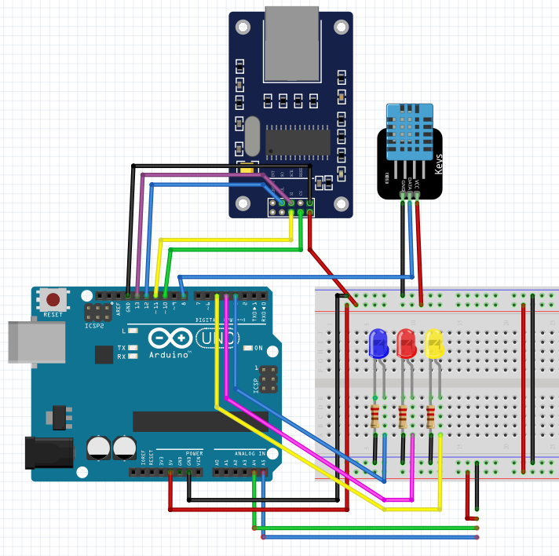
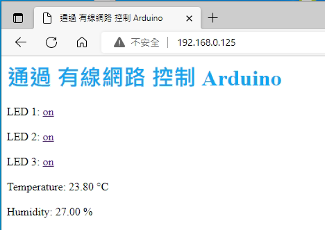

```js
#include <Wire.h>
#include <LiquidCrystal_I2C.h>
LiquidCrystal_I2C lcd(0x27, 20, 4);
#include <UIPEthernet.h>
#define STATIC 1 // 設置為 1 以禁用 DHCP
EthernetServer server = EthernetServer(80);
uint8_t mac[6] = {0x00, 0xAA, 0xBB, 0xCC, 0xDE, 0x02};
IPAddress ip(192, 168, 0, 125);
IPAddress dnss(192, 168, 0, 1);// the dns server ip
IPAddress gateway(192, 168, 0, 1);// the router's gateway address:
IPAddress subnet(255, 255, 255, 0);// the subnet:


#include "DHT.h"
#define DHTPIN 8      //讀取DHT11 Data
#define DHTTYPE DHT11 //選用DHT11   
DHT dht(DHTPIN, DHTTYPE); // Initialize DHT sensor
float h, t;

int LedPins[] = {2, 3, 4, 5, 6};
boolean PinStatus[] = {1, 2, 3, 4, 5};

boolean  output1State = false;  //設定字串變數 output26State，顯示 GPIO26 狀態。如果您要增加可控制的 GPIO 數目，請在這裡增加
boolean  output2State = false;
boolean  output3State = false;
//boolean output4State = false;
String readString = "" ;

void setup() {
  Serial.begin(9600);

#if STATIC
  Ethernet.begin(mac, ip, dnss, gateway, subnet);
#else
  if (Ethernet.begin(mac) == 0) {
//    Serial.println(F("Failed to configure Ethernet using DHCP"));
  }
#endif

  // use DHCP for gathering an IP address

  server.begin();


  Serial.print(F("localIP: "));
  Serial.println(Ethernet.localIP());
//  Serial.print(F("subnetMask: "));
//  Serial.println(Ethernet.subnetMask());
//  Serial.print(F("gatewayIP: "));
//  Serial.println(Ethernet.gatewayIP());
//  Serial.print(F("dnsServerIP: "));
//  Serial.println(Ethernet.dnsServerIP());

  //------lcd--------
  lcd.init(); // initialize LCD
  lcd.backlight(); // 開啟背光
  lcd.setCursor(0, 0);
  lcd.print(F("IP:"));
  lcd.print(Ethernet.localIP());
  lcd.setCursor(0, 1);
  lcd.print(F("Mask:"));
  lcd.print(Ethernet.subnetMask());
  lcd.setCursor(0, 2);
  lcd.print(F("gw:"));
  lcd.print(Ethernet.gatewayIP());
  lcd.setCursor(0, 3);
  lcd.print(F("dns:"));
  lcd.print(Ethernet.dnsServerIP());


  delay(1500);

  lcd.setCursor(0, 1);
  lcd.print(F("                    "));
  lcd.setCursor(0, 3);
  lcd.print(F("                    "));

  lcd.setCursor(0, 3);
  lcd.print(F("LED1:N"));

  lcd.setCursor(7, 3);
  lcd.print(F("LED2:N"));
  
  lcd.setCursor(14, 3);
  lcd.print(F("LED3:N"));
  for ( int i = 1; i <= 3; i++) {
    pinMode(LedPins[i], OUTPUT);
    PinStatus[i] = false;
  }


  dht.begin();//啟動DHT

}

void loop() {

  h = dht.readHumidity();//讀取濕度
  t = dht.readTemperature();//讀取攝氏溫度
  //  float f = dht.readTemperature(true);//讀取華氏溫度

  // 監聽客戶端傳來的數據
  EthernetClient client = server.available();
  if (client)   {
    //    Serial.println( F("new client" ));
    // 一個Http請求結尾必須帶有回車換行
    boolean currentLineIsBlank = true;
    while (client.connected())  {
      if (client.available())   {
        char c = client.read();
        readString += c;
        // 如果收到空白行，說明http請求結束，並發送響應消息
        //                if (c == '\n' && currentLineIsBlank) {
        if (c == '\n' ) {
          //          Serial.println(readString);

          if (readString.indexOf( "?ArduinoPIN1=on" ) > 0) {
            output1State = true;
            PinStatus[1] = true;
            lcd.setCursor(0, 3);
            lcd.print(F("LED1:Y"));
          }

          if (readString.indexOf( "?ArduinoPIN1=off" ) > 0) {
            output1State = false;
            PinStatus[1] = false;
            lcd.setCursor(0, 3);
            lcd.print(F("LED1:N"));
          }

          if (readString.indexOf( "?ArduinoPIN2=on" ) > 0) {
            output2State = true;
            PinStatus[2] = true;
            lcd.setCursor(7, 3);
            lcd.print(F("LED2:Y"));

          }

          if (readString.indexOf( "?ArduinoPIN2=off" ) > 0) {
            output2State = false;
            PinStatus[2] = false;
            lcd.setCursor(7, 3);
            lcd.print(F("LED2:N"));

          }

          if (readString.indexOf( "?ArduinoPIN3=on" ) > 0) {
            output3State = true;
            PinStatus[3] = true;
            lcd.setCursor(14, 3);
            lcd.print(F("LED3:Y"));
          }

          if (readString.indexOf( "?ArduinoPIN3=off" ) > 0) {
            output3State = false;
            PinStatus[3] = false;
            lcd.setCursor(14, 3);
            lcd.print(F("LED3:N"));
          }

          //          if (readString.indexOf( "?ArduinoPIN4=on" ) > 0) {
          //            output4State = true;
          //            PinStatus[4] = true;
          //            lcd.setCursor(11, 3);
          //            lcd.print(F("LED 4:Y"));
          //          }
          //
          //          if (readString.indexOf( "?ArduinoPIN4=off" ) > 0) {
          //            output4State = false;
          //            PinStatus[4] = false;
          //            lcd.setCursor(11, 3);
          //            lcd.print(F("LED 4:N"));
          //          }


          // 發送標準的HTTP響應
          client.println(F( "HTTP/1.1 200 OK" ));
          client.println(F( "Content-Type: text/html" ));
          client.println(F( "Connection: close" ));
          client.println();
          client.println(F("<meta http-equiv='Content-Type' content='text/html; charset=utf-8'>"));
          client.println(F("<meta name='viewport' content='width=device-width, initial-scale=1.0'>"));
          client.println(F("<meta http-equiv='refresh' content='3'>")); //定時10秒刷新頁面
          client.println(F("<title>通過 有線網路 控制 Arduino</title>"));
          client.println(F("<h1 style='color:#0ea6f2'>通過 有線網路 控制 Arduino</h1>"));
          client.println(F("<font size='3em'>"));
          client.println(F("<font style='display:none;'></font>"));


          if (output1State == true) {
            client.println(F("LED 1: <a href='?ArduinoPIN1=off'>off</a><br /><br />"));
          } else {
            client.println(F("LED 1: <a href='?ArduinoPIN1=on'>on</a><br /><br />"));
          }

          if (output2State == true) {
            client.println(F("LED 2: <a href='?ArduinoPIN2=off'>off</a><br /><br />"));
          } else {
            client.println(F("LED 2: <a href='?ArduinoPIN2=on'>on</a><br /><br />"));
          }

          if (output3State == true) {
            client.println(F("LED 3: <a href='?ArduinoPIN3=off'>off</a><br /><br />"));
          } else {
            client.println(F("LED 3: <a href='?ArduinoPIN3=on'>on</a><br /><br />"));
          }

          //          if (output4State == true) {
          //            client.println(F("LED 4: <a href='?ArduinoPIN4=off'>off</a><br /><br />"));
          //          } else {
          //            client.println(F("LED 4: <a href='?ArduinoPIN4=on'>on</a><br /><br />"));
          //          }

          client.println(F("Temperature: "));
          client.println(t);
          client.println(F("°C <br /><br />"));

          client.println(F("Humidity: "));
          client.println(h);
          client.println(F("% <br /><br />"));
          client.println(F("</font>"));


          for ( int i = 1; i <= 3; i++) {
            digitalWrite(LedPins[i], PinStatus[i ]);
            Serial.println(LedPins[i]);
            Serial.println(PinStatus[i]);
          }

          break;
        }
        //                if (c == '\n') {
        //                  // 已經開始一個新行
        //
        //                  currentLineIsBlank = true;
        //
        //                }
        //                else if (c != '\r') {
        //                  // 在當前行已經得到一個字符
        //                  currentLineIsBlank = false;
        //
        //                }

      }
    }
    // give the web browser time to receive the data
    delay(1);
    // close the connection:
    client.stop();
//    Serial.println(F( "client disonnected" ));
    readString = "" ;


    lcd.setCursor(0, 1);
    lcd.print(F("Temperature:"));
    lcd.print(t);

    lcd.setCursor(0, 2);
    lcd.print(F("Humidity:"));
    lcd.print(h);

    Serial.print(F("剩餘的SRAM:"));
    Serial.println( freeRam());
  }
}

int freeRam ()
{
  extern int __heap_start, *__brkval;
  int v;
  return (int) &v - (__brkval == 0 ? (int) &__heap_start : (int) __brkval);
}

```
